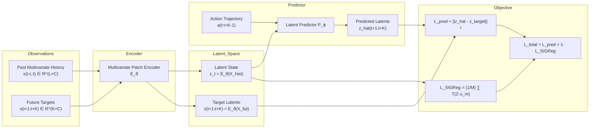

# Latent World Models for Multivariate Data using JEPA-based Architectures

[](https://www.python.org/downloads/)
[](https://pytorch.org/)
[](https://opensource.org/licenses/MIT)

> **Master's Thesis in Mathematical Engineering and Computer Science (TFM)**
> **Author:** Víctor Vallejo
> **Topic:** Joint-Embedding Predictive Architectures (JEPA) as Latent World Models for Continuous & Chaotic Multivariate Dynamical Systems.

---

## 🔬 Abstract & Research Motivation

Traditional World Models (such as Dreamer or PlaNet) rely heavily on **generative observation reconstruction** via Autoencoders, VAEs, or Diffusion Models. However, when applied to complex physical systems, sensor networks, or industrial telemetry, raw observations contain substantial high-entropy stochastic noise and non-predictable nuisance variables. Reconstructive objectives allocate disproportionate network capacity to model these irrelevant details, leading to suboptimal latent dynamics.

This work implements and studies **Joint-Embedding Predictive Architectures (JEPA)** as Latent World Models for multivariate time series and continuous dynamical systems. We leverage:

1. **Self-Supervised Latent Dynamics Prediction** ($P_\phi(z_t, a_{t:t+k}) \to \hat{z}_{t+k}$) without observation decoding.
2. **Sketched Isotropic Gaussian Regularization (SIGReg)** based on the Cramér-Wold projection device and exact closed-form 1D Epps-Pulley test statistic to prevent representation collapse.
3. **Linear Identifiability & Physical Recovery**: Theoretical and empirical validation that LeJEPA recovers ground-truth physical state variables up to an orthogonal rotation ($h(s) = Qs$).
4. **Direct Latent Model Predictive Control (MPC)**: Real-time action sequence optimization via Cross-Entropy Method (CEM) and Model Predictive Path Integral (MPPI) operating entirely in the latent space.

---

## 🏛️ Architecture Overview



---

## 📦 Project Structure

```
├── jepa_wm/
│   ├── core/                  # Multivariate Encoders, Predictors, World Models & Baselines
│   ├── losses/                # SIGReg (closed-form), VICReg, InfoNCE, Rollout Loss
│   ├── data/                  # Dynamical systems (Lorenz-63/96, Oscillators, Nuisance Noise)
│   ├── diagnostics/           # Linear Identifiability, Effective Rank, CCA, Procrustes
│   ├── planning/              # Latent MPC: CEM and MPPI Planners
│   ├── training/              # Trainers, Schedulers, and Evaluators
│   └── utils/                 # Logging, Metrics, and Visualizations
├── experiments/               # Reproducible benchmark experiments
├── tests/                     # Comprehensive pytest test suite
└── docs/                      # Mathematical derivations, thesis blueprint, and API documentation
```

---

## 🚀 Quickstart & Installation

```bash
# Clone the repository
git clone https://github.com/vvalleejo/TFM_VictorVallejo.git
cd TFM_VictorVallejo

# Install package in editable mode with development dependencies
pip install -e .
pip install -e ".[dev]"

# Run tests
pytest tests/
```

---

## 📚 Mathematical Documentation

See [docs/theoretical_foundations.md](docs/theoretical_foundations.md) and [docs/thesis_blueprint.md](docs/thesis_blueprint.md) for full mathematical derivations, proofs of linear identifiability, and the complete Master's Thesis chapter plan.
